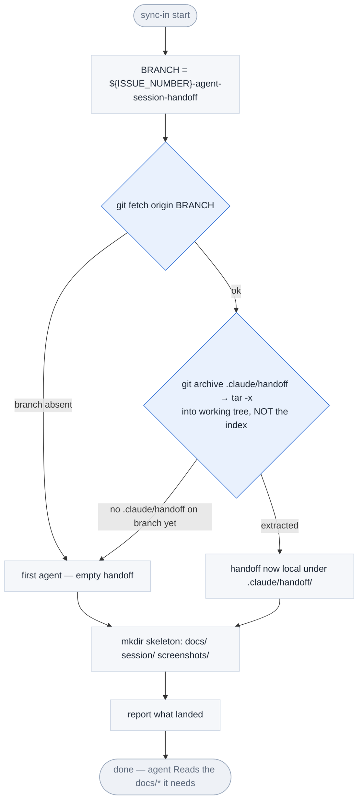

# handoff-sync-in — flow

Read-only pull of `.claude/handoff/` from the handoff branch into the runner's working tree. Never commits, never touches the git index. Full contract: [SKILL.md](./SKILL.md).

**Key point:** extraction uses `git archive` (streams to disk), not `git checkout <branch> -- path` — so nothing is staged and handoff files can never leak into the feature branch's PR (they are also gitignored in the repo).
