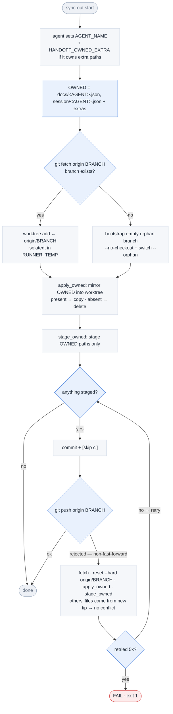

# handoff-sync-out — flow

Write this agent's owned handoff/session files back to the handoff branch, from an isolated worktree, with a non-fast-forward retry loop. Full contract: [SKILL.md](./SKILL.md).

**Invariants the diagram encodes:**

- **Isolation** — all commit/push happens in a worktree under `RUNNER_TEMP`, never in the feature checkout → nothing leaks into the code PR.
- **Ownership** — only `OWNED` paths are touched (`apply_owned` + `stage_owned`); on non-fast-forward the reset + re-apply takes others' files from the new tip, so the retry never hits a merge conflict and never clobbers another agent.
- **Cleanup** — the worktree is removed on any exit (success, failure, or `set -e` abort) via an `EXIT` trap.
