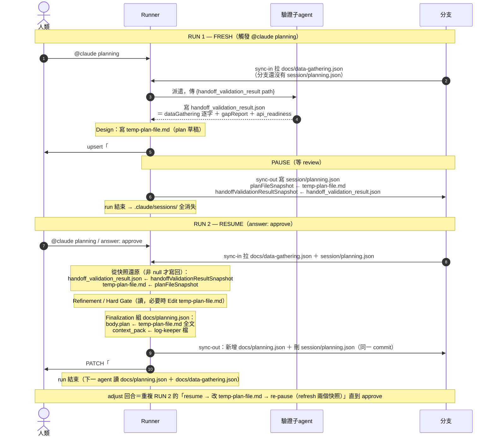
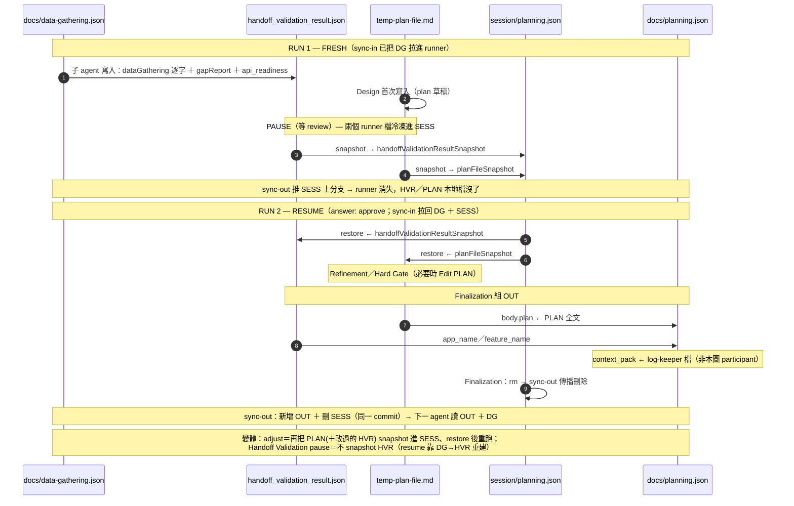

# Planning Agent 交接機制與細節備忘

> 這份只記**非顯而易見的機制與踩雷點**。
>
> - 欄位定義：`handoff-schema.md`。
> - Agent 本體規則：`planning.md`（主 agent）、`handoff-validation.md`（validation 子 agent）。
> - 兩支搬運 skill：`handoff-sync-in`、`handoff-sync-out`（各自獨立 plugin，各有 `FLOW.md`）。
>
> 技術名詞（欄位名、檔名、marker、指令）一律保留原文。

---

## 0. State model 一覽（先建立心智模型）

planning 在 GitHub Actions **headless** 執行：無 TTY、無 `AskUserQuestion`。**跨 run 的持久狀態活在兩處**：機器狀態在**每個 issue 一條的 handoff 分支**（`{ISSUE_NUMBER}-agent-session-handoff`）上的檔案；人機互動在 **issue 留言**。runner 上的工作檔每次 run 之間都會被清空。

| 產物                                           | 型態                            | 存活範圍                          | 角色                                                                                                                    |
| ---------------------------------------------- | ------------------------------- | --------------------------------- | ----------------------------------------------------------------------------------------------------------------------- |
| `docs/data-gathering.json`                     | handoff 分支檔                  | 分支存活期間                      | handoff **輸入**（data-gathering 寫）。planning 唯讀。                                                                  |
| `docs/planning.json`                           | handoff 分支檔                  | 分支存活期間                      | handoff **輸出**（planning 在 Finalization 寫；含 `body.plan` 給下一個 agent）。                                        |
| `session/planning.json`                        | handoff 分支檔                  | **只在 pause 時存在**，完成即刪   | **跨 run 續跑封包**（見 §2）。                                                                                          |
| `## Planning Document`                         | issue 留言                      | 永久                              | 給人類 review 的**可讀 plan**。upsert（跨 adjust 回合都 PATCH 同一則）。與 `body.plan` 逐字相同。                       |
| `.claude/log/sessions/issue-<N>/planning.json` | runner 檔（ES 為 durable 底層） | 檔案單一 run 內；歷史靠 ES 跨 run | log-keeper skill 寫的 session log。skill 每次寫入 best-effort 鏡射進 ES 並先 reconcile，故跨 run 歷史活在 ES（見 §7）。 |
| `handoff_validation_result.json`               | runner 檔                       | **單一 run 內**                   | 本次 run 的**工作用單一真相（working SoT）**（見 §3）。                                                                 |
| `temp-plan-file.md`                            | runner 檔                       | **單一 run 內**                   | plan 草稿工作檔。                                                                                                       |

> **鐵律**：這些 runner 檔（`handoff_validation_result.json`、plan file、log-keeper 檔）**不會跨 run 存活**。持久性來自 handoff 分支檔（+ 人機留言）；log-keeper 檔額外靠 skill 的 best-effort ES 撐跨 run 歷史。
>
> **runner 檔位置**：`handoff_validation_result.json`、`temp-plan-file.md` 都在 **`.claude/sessions/`**（gitignored，永不進 commit）；log-keeper 檔在 `.claude/log/sessions/issue-<N>/`。

---

## 1. 兩支搬運 skill（sync-in / sync-out）— 檔案模型的核心

handoff 分支檔靠兩支 skill 搬；planning 不自己 hand-roll git。

| skill              | 何時                               | 做什麼                                                                                       |
| ------------------ | ---------------------------------- | -------------------------------------------------------------------------------------------- |
| `handoff-sync-in`  | **每個 run 一開頭**                | 把整個 `.claude/handoff/` 從分支拉進 runner（唯讀、不進 index）。之後讀 handoff = 讀本地檔。 |
| `handoff-sync-out` | 要**持久化**時（pause / finalize） | 隔離 worktree 把**自己 owned 的檔**寫回分支、commit、push（含 non-ff retry）。               |

**必守：呼叫 sync-out 時，在同一段 bash script 設 `AGENT_NAME=planning`**（skill 用它挑 owned 路徑）。planning owns `docs/planning.json` + `session/planning.json`，只碰這兩支、絕不動別人的檔。

- **ownership 傳播刪除**：本地某 owned 檔不存在 → sync-out 把它從分支刪掉。這是完成時清 `session/planning.json` 的正規手段（先 `rm` 本地檔，再 sync-out）。
- 為何不能只靠 `GITHUB_ENV` 帶 `AGENT_NAME`：agent 是在 Claude 步驟**執行中**才被選定，`GITHUB_ENV` 只影響後續步驟；且 Bash tool 的 shell 狀態不跨呼叫保留。所以值要 inline 設在跑 sync-out 的那段 script（值來自各 agent frontmatter 的 `name`）。

> **弄錯會怎樣**：sync-out 忘了設 `AGENT_NAME` → skill 早期 guard 直接報錯中止（不會靜默寫錯檔）。

---

## 2. runner 檔 ↔ session/planning.json 快照 的關係

runner 檔會消失，所以**暫停時**要把它們「冷凍」進 `session/planning.json`（一支 handoff 分支檔，非留言）：

| runner 檔（活資料）              | session/planning.json 內的快照欄位（冷凍備份） |
| -------------------------------- | ---------------------------------------------- |
| `handoff_validation_result.json` | `handoffValidationResultSnapshot`              |
| `temp-plan-file.md`              | `planFileSnapshot`                             |

`session/planning.json` 欄位：`pausedAt, resumeStep, pendingQuestion, pauseCommentId, initialDirective, handoffValidationResultSnapshot, planFileSnapshot`。

### 運作方向

- **暫停時**：把當下的 `handoff_validation_result.json`、plan file 內容寫進 `session/planning.json` 對應快照欄位，`Write` 後 sync-out 推上分支。
- **續跑時（新 run、空 runner）**：run 開頭 sync-in 已把 `session/planning.json` 拉回本地 → 讀它 → 把快照**寫回**對應 runner 檔 → 從 `resumeStep` 繼續。

### `planFileSnapshot` 為什麼一定要存

plan 草稿在 pause 前可能已被做過**只影響呈現的微調**。續跑若「重新生成 plan」會洗掉。快照把**當下那份 plan 逐字保留**，續跑直接還原、不重生。

### 為何 branch 上有檔，snapshot 仍不能省

`docs/data-gathering.json` 就在分支上，容易誤以為「續跑重讀它即可、不必 snapshot」。**錯**——它只有**原始輸入**。`handoffValidationResultSnapshot` 存的是分支上**根本沒有**的東西：

- **驗證產出**：`gapReport`（hardBlocks / inferred / clean）、`api_readiness`——validation 子 agent 本 run 才算出來的。
- **planning 在地修正**：Refinement 的 `adjust: source data correction` 覆寫掉的 `api_readiness` / routes / feature scope（**不寫回** `docs/data-gathering.json`，那份保持原始輸入）。

沒 snapshot → 續跑得**重跑 validation 子 agent**，且**丟掉** Refinement 的來源修正。`planFileSnapshot` 同理：plan 是**輸出**，暫停時分支上還沒有 `docs/planning.json`（只在 Finalization 才寫）。

> 為何內嵌 session 而不拆成獨立分支檔：一個 pause packet = 一個原子檔，且每次 pause 本來就 sync-out `session/planning.json`，內嵌不增加成本。分支 commit 無字元上限——`dataGathering.body` 與 `docs/data-gathering.json` 的重複很便宜，換來續跑邏輯簡單（整包還原，不必 merge delta）。

### null 快照 = 「沒東西可還原」，不是「寫入 null」

- `handoffValidationResultSnapshot` null → `resumeStep` = `Handoff Validation`、續跑重驗重建。兩種來源：validation 還沒產出結果，**或** Handoff Validation pause（`pendingQuestion: null`）故意把過期的那份寫成 null（resume 必然重驗覆寫，見 planning.md 快照規則例外）。**別**把 null 寫成檔案。
- `planFileSnapshot` null → plan 還沒草擬，別還原。
- `initialDirective` null → 沒引導語，或已被 Design 消耗。

> **檔案模型的好處**：`session/planning.json` 是檔案、**沒有** comment 的 ~65,536 字元上限，也沒有「把大 JSON 塞進留言」的跳脫地雷（Write 直接寫、git 逐字 commit）。

---

## 3. 為什麼要獨立的 working json（`handoff_validation_result.json`）

- **加工後 vs 原始**：`docs/data-gathering.json` 是原始輸入。`handoff_validation_result.json` 是**加工版** = 原始 + 驗證結論（`gapReport`、`api_readiness`）+ 本 run 在地修正（例如從 `dataGathering.context_pack` 解掉某個 hardBlock）。plan 照這個 json 畫。
- **成本**：本地檔 `Read`/`Edit` 便宜、可隨意改；不用每改一次就 sync-out。
- **子 agent 交接載體**：validation 子 agent 的結構化產出就是這個檔（見 §8）。
- **形狀**（validation 子 agent 寫、planning 讀）：

  ```
  { app_name, feature_name, api_readiness,
    dataGathering: { context_pack, body: { issue, figmaData, confluenceData, codeBaseData, unresolved } },  // 輸入逐字
    payload: { phase: "planning", gapReport: { hardBlocks, inferred, clean } } }                            // 驗證產出
  ```

  Design 讀 `dataGathering.body.*`；hardBlock 檢查讀 `payload.gapReport.hardBlocks`；`api_readiness` 在頂層。

> validation 之後，主 agent **只認 `handoff_validation_result.json`**，不再回頭讀 `docs/*.json`。

---

## 4. Re-plan 行為（覆寫、不重複、免清理）

一 agent 一檔：re-plan 時 planning 直接**覆寫**自己的 `docs/planning.json`，`docs/data-gathering.json` 不動；不會出現重複 entry，也不需任何清理 / strip 步驟。validation 子 agent 也只讀 `docs/data-gathering.json`。

---

## 5. 仍是 comment 的東西（人機介面）

不是所有東西都搬檔——**人看的、人回的**留在 issue 留言：

- `## Planning Document`：給人 review 的 plan。**upsert**（用前綴找 id → 有就 PATCH、沒有才新增一則；跨 adjust 回合都 PATCH 同一則，別貼第二份）。內容與 `docs/planning.json` 的 `body.plan` **逐字相同**（同一份 plan 寫兩處）。
- **觸發 / 回覆**：`@claude planning`、`answer:`、完成通知——都是留言。

> log-keeper 的 log **不再是留言**（見 §7）——改由 skill 寫本地檔 + best-effort ES。

序列化：`## Planning Document` 裝 plan markdown（非 JSON）。一律用 `gh ... --body-file` 送，別在 shell 手拼。handoff / session 是檔案（Write 直接寫、git 逐字 commit），無字數上限、無跳脫/fence 抽取問題。

> **弄錯會怎樣**：`## Planning Document` 用新增而非 PATCH → 一個 issue 多則同類留言，`.[0]` 取到舊的、狀態錯亂。

---

## 6. 暫停 / 續跑機制

### `pendingQuestion`：null vs 非 null 決定續跑怎麼走

- **非 null**：在等**人類的文字回覆**。續跑要做 answer 解析（見下）與 empty-answer guard。
- **null**：在等**上游資料 / agent 重跑**（無 handoff、hardBlock 升級）。續跑**跳過** answer 解析，直接對「已更新的 `docs/data-gathering.json`」（本 run sync-in 剛拉的）重新驗證。

### `pauseCommentId`：answer 搜尋的錨點

它是**bot 貼的「問題」留言** id，**永遠不是答案**。答案一定是另一則、更新的留言。Tier-2 fallback 只找 `id > pauseCommentId` 的 non-bot 留言。（問題與回覆都在留言——這部分沒變。）

### 兩層 answer 解析（two-tier）

1. **Tier 1 — `TRIGGER_COMMENT_BODY`（主）**：env 非空就從它解析（觸發本 run 的留言原文、位置無關）。
2. **Tier 2 — `gh api` fallback**：僅 Tier 1 空/缺時用。找「非 bot、含觸發語、`id > pauseCommentId`、最新」的留言。

- **Empty-answer guard**：`pendingQuestion` 非空但解析出的回覆是空 → **不要**硬跑，用同樣的 `pendingQuestion`/`resumeStep` 重新 pause，tag 剛回空的人（`@<COMMENTER>`）。

### `initialDirective`

FRESH run 時，從觸發留言**觸發語之後**的文字解析出的引導語（有 steering signal 才留）。**攜帶到 Design 才消耗一次**；pause 發生在 Design 前時，靠 `session/planning.json` 的 `initialDirective` 保住。

---

## 7. `context_pack` 跨 run 的收割

- `docs/planning.json` 的 `payload.context_pack` 由**主 agent 在 Finalization 才填**（validation 子 agent 不寫它）。
- 來源是 log-keeper 寫的本地檔 `.claude/log/sessions/issue-<N>/planning.json`。收割一律在 **Finalization flush 之後**做——那次 flush 才讓本地檔變完整（skill 併入本 run entry 並從 ES reconcile 跨 run 歷史）。
- 收割：`Read` 該檔 → **直接取** `session.context_pack` → 寫進 `docs/planning.json` 的 `payload.context_pack`。防禦性去重（`name`+`task_title`+`decision` 完全重複留第一筆）。
- **完全信任 skill 留在檔裡的內容**——不額外驗證、不 re-fetch、不 fallback。best-effort 漏一筆（skill 自己的契約）只會讓這個 audit 欄位變薄，不影響 `body.plan`。

> **關鍵前提**：跨 run 歷史靠 skill 的 ES reconcile 撐（本地檔本身不跨 run 存活）。續跑是全新 process、空 runner——若某次 pause 期間 ES 沒寫成功，那次的 `context_pack` 就回不來，且無錯誤訊號。這是 scoping 決定（不改 log-keeper skill）換來的已知取捨，範圍侷限在 `context_pack` 這個 audit 欄位。

### 為何不靠 in-memory 累積

planning 幾乎必然多 run（review 是強制 pause），每次 resume 是全新 runner、in-memory 空。所以 context_pack 必須由 skill 收束（本地檔 + ES reconcile），不能只靠本 run 記憶體——否則最終只剩最後一個 run 的 context_pack，缺掉 review 前所有 run 的推論/裁決。

---

## 8. 子 agent 交接契約（`RESULT_FILE`）

- 主 agent 在 Handoff Validation 用 `Task` 派 `handoff-validation.md`。
- validation 子 agent **只回一句**：`RESULT_FILE: .claude/sessions/handoff_validation_result.json`。結構化產出是那個檔，不是回傳文字。
- validation 子 agent 讀 **`.claude/handoff/docs/data-gathering.json`**（本地檔，主 agent 已在 Startup sync-in），**純偵測**：不 fetch、不 enrich、不用 MCP、不碰留言。缺資料由主 agent bounce（§6 的 null-pause）。

---

## 9. Finalization 寫回與驗證

順序不可亂（log 先寫才能 harvest；`docs/planning.json` 組好才能 sync-out；本地 session 檔要先刪才能靠 sync-out 傳播刪除）：

1. Log-keeper flush COMPLETE。
2. harvest `context_pack`（`Read` log-keeper 檔 `.claude/log/sessions/issue-<N>/planning.json`）。step 1 剛 flush，已含本 run。
3. **組並 `Write` `docs/planning.json`（唯一一次寫，別在前面 piecemeal 寫）**：standalone planning payload —`app_name`/`feature_name`（來自 handoff_validation_result）+ step 2 的 `context_pack` + plan file 文字當 `body.plan`（`payload` 只放這幾個 key，別把工作檔的 `payload.gapReport` 帶進來）；不含 data-gathering 內容。
4. PATCH `## Planning Document` = 與 `payload.body.plan` **逐字相同**（人類鏡像）。plan 若在出示後又變過就一併對齊。
5. **`rm` 本地 `session/planning.json`，再 sync-out（`AGENT_NAME=planning`）**：一個 commit 同時 **新增** `docs/planning.json` + **刪除** `session/planning.json`（本地缺 → 傳播刪除）。
6. **驗證**：sync-out 非 0 退出（重試後仍失敗）→ **停下報錯，不算完成**。分支未變（commit 沒 push），下個 run sync-in 會還原 `session/planning.json`、Finalization 乾淨重做（harvest + assemble + sync-out 皆 idempotent）。
7. post 完成 comment，tag assignee（CC commenter）；下一 agent 從 `docs/planning.json`（+ `docs/data-gathering.json`）接手。

> **弄錯會怎樣**：先刪 session 又沒等 sync-out 成功就當完成 → 若 push 失敗，分支還留著舊 session、沒 docs/planning.json；靠「sync-out 失敗即報錯、保持可重跑」避免孤兒。

---

## 10. 環境變數速查（workflow 注入）

| Var                    | 意義                                                       |
| ---------------------- | ---------------------------------------------------------- |
| `ISSUE_NUMBER`         | 本 run 掛的 issue，**也用來組 handoff 分支名**             |
| `TRIGGER_COMMENT_BODY` | 觸發本 run 的留言原文（`workflow_dispatch` 時為空）        |
| `COMMENTER`            | 觸發者 GitHub login（`workflow_dispatch` 時為空）          |
| `GH_TOKEN`             | `gh` CLI 讀寫留言用；git push handoff 分支的認證亦靠它     |
| `GH_REPO`              | `owner/repo`（`gh api` 用；sync skill 走 `origin` 不讀它） |

> sync-out 的 push 靠 `actions/checkout` persist 的 credential → 觸發 workflow 需 `contents: write`。

# Planning Agent 流程

## 文字流程

### 0. Startup — 判斷 Fresh 或 Resume

- **先 `handoff-sync-in`**（把 `.claude/handoff/` 拉進 runner）。
- 看本地 `session/planning.json` 是否存在。
  - 不存在 → FRESH，解析 initialDirective，進「1. Handoff Validation」。
  - 存在 → RESUME：
    - 還原 snapshot（handoffValidationResultSnapshot、planFileSnapshot，非 null 才寫回）。
    - pendingQuestion == null（等上游/agent）→ 跳過答案解析，直接從 resumeStep 重跑。
    - pendingQuestion 非 null（等人類）→ 解析回答：Tier1 TRIGGER_COMMENT_BODY，否則 Tier2 gh api。
      - 回答空白 → Pause Protocol（tag COMMENTER、resumeStep 不變）→ 停止等回覆。
      - 有回答 → 套用後從 resumeStep 重跑。

### 1. Handoff Validation

- Read handoff-schema.md，檢查本地 `docs/data-gathering.json`（sync-in 已拉）。
  - 不存在 → Pause Protocol（pendingQuestion=null、tag @<assignee>）→ 停止，等人請 data-gathering 產出 handoff。
- 派遣 handoff-validation subagent：
  - Step A：**讀 `docs/data-gathering.json`（本地檔），收集 gap**（figmaData/confluenceData/codeBaseData/body.unresolved），僅偵測不擷取。
  - Step B：**分類每個 gap** → hardBlocks / inferred。
  - Step C：**判 api_readiness** — 查 issue `## API 規格` 或 confluenceData → ready / mock。
  - Step D：**寫 handoff_validation_result.json**（dataGathering 逐字複製 + payload{phase:planning, gapReport} + top-level api_readiness；top-level routes 交給 planning 推論、不寫）。
- Read handoff_validation_result.json（之後唯一真實來源）。
- 檢查 `payload.gapReport.hardBlocks`：
  - 無 → 進「2. Reference Docs」。
  - 有 → 先讀 `dataGathering.context_pack`（已在 `handoff_validation_result.json` 裡逐字複製，免額外查詢）嘗試解決。
    - 全部可解 → Edit result 移出 hardBlocks → 進 Reference Docs。
    - 仍有剩 → Pause Protocol（pendingQuestion=null、tag @<assignee>）→ 停止，等人補資料。

### 2. Reference Docs

- 讀 codeBaseData.referenceDocs（生成的背景，不檢衝突）+ AGENTS.md / CLAUDE.md（手寫規範，檢衝突）。
- 衝突？無/可調和 → 遵循規範、記 context_pack → 進「3. Design」；模糊需裁決 → Pause Protocol（tag assignee、resumeStep=Reference Docs）。

### 3. Design（依 planning-template.md 填）

- Handoff Quality、External References、Routes（推論、不 bounce）、Codebase Context、API Layer Strategy（ready 或 confluenceData.apis[] 有資料 → 寫 ### API Spec；否則 mock → 寫 ### Mock Data Implementation）、Layout（截圖在 `.claude/handoff/screenshots/`）、Feature List。

### 4. Writing Plan File

- Write plan file → Pre-show check（Hard Gate 結構項，loop 至通過）。
- upsert `## Planning Document` comment（每輪 adjust 都 PATCH 同一則）。
- Pause Protocol（tag assignee、resumeStep=Refinement、snapshot handoff+plan 進 session/planning.json）→ 停止等 review。

### 5. Refinement（resume 後，語意分類 intent）

- approve → 進「6. Hard Gate」。
- adjust → 更新 result/plan → 重跑 Pre-show → PATCH ## Planning Document → Pause Protocol（refresh snapshot）→ 停止等 review。
- question → post 答覆 comment → Pause Protocol → 停止等 review。
- major-scope → 跳回「1. Handoff Validation」（run 內，非 pause）；子 agent 重讀 `docs/data-gathering.json`。

### 6. Hard Gate

- 跑完整 checklist；未過 → Edit 修復再驗；全過 → 進「7. Finalization」。

### 7. Finalization（順序不可亂）

1. Log-keeper flush COMPLETE。
2. harvest context_pack（`Read` log-keeper 檔 `.claude/log/sessions/issue-<N>/planning.json`）。
3. **組並 Write `docs/planning.json`（唯一一次寫）**：app_name/feature_name（來自 handoff_validation_result）+ step 2 的 context_pack + plan file 文字當 `body.plan`。
4. PATCH `## Planning Document` = 與 `body.plan` 逐字相同（人類鏡像）。
5. `rm` 本地 `session/planning.json` → sync-out（AGENT_NAME=planning）：一次 commit 新增 docs/planning.json + 刪 session。
6. **驗證 sync-out 成功**；失敗 → 停止並回報、不算完成（分支未變 → 可重跑）。
7. post 完成 comment，tag assignee（CC commenter）。→ END，下一 agent 從 `docs/planning.json` 接手。

## 與人類互動的時機點

| #   | Pause / 互動點                                 |           走 Pause Protocol?            |  session/planning.json  | log flush | tag                                  |
| --- | ---------------------------------------------- | :-------------------------------------: | :---------------------: | :-------: | ------------------------------------ |
| 1   | Startup 空回覆 guard                           |                    ✓                    |            ✓            |     ✓     | @<COMMENTER>                         |
| 2   | Handoff Validation 無 docs/data-gathering.json |         ✓ pendingQuestion=null          |            ✓            |     ✓     | @<assignee>                          |
| 3   | Handoff Validation hardBlock 升級              |         ✓ pendingQuestion=null          |            ✓            |     ✓     | @<assignee>                          |
| 4   | Reference Docs 規範衝突裁決                    |                    ✓                    |            ✓            |     ✓     | @<assignee>                          |
| 5   | Writing Plan File 等 review                    |              ✓ 雙 snapshot              |            ✓            |     ✓     | @<assignee>                          |
| 6   | Refinement adjust                              |                    ✓                    |            ✓            |     ✓     | @<assignee>                          |
| 7   | Refinement question                            |                    ✓                    |            ✓            |     ✓     | @<assignee>                          |
| —   | Refinement major-scope                         | 非 pause，run 內跳回 Handoff Validation |            —            |     —     | —                                    |
| —   | Finalization（完成路徑）                       |                    —                    | 刪（sync-out 傳播刪除） | COMPLETE  | 寫 docs/planning.json + 完成 comment |

每次 pause 一律：

1. Log-keeper flush BLOCKED — 先記「此次 pause 本身」（原因 + pendingQuestion/等待事件 + resumeStep），再 persist 其餘 actions/context_pack。
2. post 人類面向問題 comment，記下 id 當 pauseCommentId。
3. Write `session/planning.json`（pausedAt / resumeStep / pendingQuestion / pauseCommentId / initialDirective / 兩個 snapshot）→ sync-out（AGENT_NAME=planning）。
4. **確認 sync-out 成功**再乾淨停止 exit0（pause 非 failure）；sync-out 失敗 → 不當成功 pause、報錯 exit≠0（否則下個 run sync-in 找不到 session、誤判 FRESH、丟失 resumeStep+snapshot）。之後 `@claude planning` 再觸發 → 回到 Startup（先 sync-in）。

### 三個不變量

- 每個 pause 都寫 `session/planning.json` 並 sync-out。
- 每個 pause 都 flush 當下為止的 log（含 pause 事件本身）。
- Finalization 把最新 handoff（docs/planning.json）+ log 寫回，sync-out 成功才算完成、才清 session。

## Mermaid 流程

```mermaid
flowchart TD
  START(["START：@claude planning 或 workflow_dispatch 觸發"]) --> SI0[/"handoff-sync-in：拉整個 .claude/handoff 進 runner"/]
  SI0 --> B{"本地 session/planning.json 存在?"}

  %% ---------- Startup ----------
  B -- "無 → FRESH" --> FR0["解析 initialDirective：intent 有訊號才 hold（空泛丟棄）"]
  FR0 --> HV0
  B -- "有 → RESUME" --> RS0["還原 snapshot（非 null 才寫回）：\nhandoffValidationResultSnapshot → result 檔\nplanFileSnapshot → plan 檔\ninitialDirective → 帶進 Design"]
  RS0 --> R1{"pendingQuestion == null?"}
  R1 -- "是（等上游/agent）" --> RJ["resume：進入 resumeStep"]
  R1 -- "否（等人類）" --> R2["解析回答：Tier1 TRIGGER_COMMENT_BODY → Tier2 gh api"]
  R2 --> R3{"回答空白?"}
  R3 -- "否" --> RA["套用回答"] --> RJ
  RJ -.->|resumeStep| HV0
  RJ -.->|resumeStep| RD0
  RJ -.->|resumeStep| REF0

  %% ---------- Handoff Validation ----------
  HV0["Handoff Validation：Read handoff-schema.md"] --> HV1{"本地 docs/data-gathering.json 存在?"}
  HV1 -- "有" --> SUBin

  subgraph SUB["handoff-validation subagent（Task 派遣 · 純偵測 · 無 MCP）"]
    direction TB
    SUBin(["進入子 agent"]) --> SA1[/"Read .claude/handoff/docs/data-gathering.json（本地檔）"/]
    SA1 --> SA2["Read handoff-schema.md（欄位形狀）"]
    SA2 --> SA3["Step A：收集 gap — figmaData.unresolved / confluenceData 缺+unresolved / codeBaseData.unresolved / body.unresolved（僅偵測不擷取）"]
    SA3 --> SB["Step B：分類每個 gap → hardBlocks（無法推論）或 inferred（可推論）"]
    SB --> SC["Step C：api_readiness — 查 issue ## API 規格 或 confluenceData → ready / mock"]
    SC --> SD[/"Step D：Write handoff_validation_result.json — dataGathering 逐字 + payload{phase:planning, gapReport} + api_readiness；top-level routes 不寫（planning 推論）"/]
    SD --> SDout(["return RESULT_FILE"])
  end

  SDout --> HV5[/"Read handoff_validation_result.json（唯一真實來源）"/]
  HV5 --> HV6{"payload.gapReport.hardBlocks 有?"}
  HV6 -- "無" --> RD0
  HV6 -- "有" --> HV7["讀 dataGathering.context_pack（已在 handoff_validation_result.json 內）"] --> HV8{"全部可從 context_pack 解決?"}
  HV8 -- "是" --> HV9["Edit result 解決、移出 hardBlocks"] --> RD0

  %% ---------- Reference Docs ----------
  RD0["Reference Docs：讀 referenceDocs（不檢衝突）+ AGENTS/CLAUDE.md"] --> RD1{"codebase 與規範 衝突?"}
  RD1 -- "無 / 可調和" --> RD2["遵循規範、記 context_pack"] --> DIR0

  %% ---------- Design + Writing Plan ----------
  DIR0["消費 initialDirective（若有）：steering hint — 可調 emphasis/scope；不覆寫 handoff/驗收清單；衝突標 scope note + 記 context_pack"] --> DES0
  DES0["Design：填 template — Handoff Quality / External Refs / Routes（推論）/ Codebase Context / API Layer Strategy / Layout（.claude/handoff/screenshots/）/ Feature List"] --> WP1["Write plan file"]
  WP1 --> WP2{"Pre-show check：Hard Gate 結構項全過?"}
  WP2 -- "否" --> WP2F["Edit 修復"] --> WP2
  WP2 -- "是" --> WP3[/"upsert ## Planning Document comment（出示 plan 給人類 review）"/]

  %% ---------- Refinement ----------
  REF0["Refinement：語意分類 intent"] --> REF1{"approve / adjust / question / major-scope?"}
  REF1 -- "approve" --> HG0
  REF1 -- "adjust" --> REF2["更新 result/plan → 重跑 Pre-show → PATCH ## Planning Document"]
  REF1 -- "question" --> REF3["post 答覆 comment 給人類"]
  REF1 -- "major-scope" --> HV0

  %% ---------- Hard Gate ----------
  HG0["Hard Gate：完整 checklist"] --> HG1{"全部通過?"}
  HG1 -- "否" --> HG2["Edit 修復 + 重驗"] --> HG0
  HG1 -- "是" --> FIN

  %% ---------- Finalization ----------
  FIN["Finalization"] --> F1["1. Log-keeper flush COMPLETE"]
  F1 --> F2["2. harvest context_pack（Read log-keeper 檔 .claude/log/sessions/issue-N/planning.json）"]
  F2 --> F3["3. 組並 Write docs/planning.json（唯一一次）：app/feature + context_pack + body.plan"]
  F3 --> F4[/"4. PATCH ## Planning Document = body.plan 逐字（人類鏡像）"/]
  F4 --> F5["5. rm 本地 session/planning.json → handoff-sync-out（AGENT_NAME=planning）：一次 commit 加 docs/planning.json + 刪 session"]
  F5 --> F6{"sync-out 成功?"}
  F6 -- "否" --> SF(["STOP：回報失敗，分支未變 → 保持可重跑"])
  F6 -- "是" --> F9[/"6. post 完成 comment給人類：tag assignee（CC commenter）"/]
  F9 --> END(["END：規劃完成，下一 agent 從 docs/planning.json 接手"])

  %% ---------- Pause Protocol（7 個 pause 點全部匯入）----------
  R3  -- "是 · tag COMMENTER · resumeStep 不變 · pendingQuestion 不變" --> PPin
  HV1 -- "無 · tag @<assignee> · resumeStep=Handoff Validation · pendingQuestion=null" --> PPin
  HV8 -- "否（有剩）· tag @<assignee> · resumeStep=Handoff Validation · pendingQuestion=null" --> PPin
  RD1 -- "模糊需裁決 · tag assignee · resumeStep=Reference Docs" --> PPin
  WP3 -- "tag assignee · resumeStep=Refinement · snapshot handoff+plan" --> PPin
  REF2 -- "refresh snapshot · resumeStep=Refinement" --> PPin
  REF3 -- "resumeStep=Refinement" --> PPin

  subgraph PP["Pause Protocol（子流程 · 每個 pause 共用）"]
    direction TB
    PPin(["進入 Pause Protocol"]) --> P1["① Log-keeper flush BLOCKED：先記『此次 pause 本身』（原因 + pendingQuestion/等待事件 + resumeStep），再 persist 其餘 actions/context_pack"]
    P1 --> P2[/"② post 人類面向問題 comment，capture id → pauseCommentId"/]
    P2 --> P3[/"③ Write session/planning.json（pausedAt / resumeStep / pendingQuestion / pauseCommentId / initialDirective / 兩個 snapshot）→ handoff-sync-out（AGENT_NAME=planning）"/]
    P3 --> P4(["④ 確認 sync-out 成功 → 乾淨停止 exit0；失敗則報錯 exit≠0（否則 session 未持久化、resume 誤判 FRESH）"])
  end

  P4 -.->|"人類/上游 @claude planning 再觸發"| START

  %% ---------- Styling ----------
  classDef proc  fill:#f5f7fa,stroke:#cbd5e3,color:#1c2634;
  classDef dec   fill:#e9f1fd,stroke:#2f6fd6,color:#1c2634;
  classDef user  fill:#e7f6ee,stroke:#1f9d54,color:#1c2634;
  classDef agent fill:#f1ecfb,stroke:#7c4ddb,color:#1c2634;
  classDef term  fill:#eef1f6,stroke:#94a3b8,color:#5f6b7d;

  class END,SUBin,SDout,PPin,P4,SF term;
  class B,R1,R3,HV1,HV6,HV8,RD1,REF1,HG1,F6,WP2 dec;
  class SA1,SA2,SA3,SB,SC,SD agent;
  class R2,RA,WP3,REF3,F9 user;
  class SI0,HV0,RJ,HV5,HV7,HV9,RD0,RD2,DES0,WP1,WP2F,REF0,REF2,HG0,HG2,FIN,F1,F2,F3,F4,F5,P1,P2,P3,FR0,DIR0,RS0 proc;

  style SUB fill:#faf8ff,stroke:#7c4ddb,stroke-dasharray:4 3
  style PP  fill:#fbfcfe,stroke:#94a3b8,stroke-dasharray:4 3

  style START fill:#1d4ed8,stroke:#1e3a8a,stroke-width:2px,color:#ffffff
```



---

## Mermaid 資料流（四個檔案跨 run 的生命週期）

> 上面的流程圖看**控制流**；這張看**資料流** —— 四個檔案在跨 run 間如何產生 / 快照 / 還原 / 落地。以典型「1 次 review pause」＝ 2 個 run 呈現。
>
> - **Runner** = 本次 run 的 `.claude/sessions/` 工作檔（每 run 重生消失）；**分支** = handoff 分支 `.claude/handoff/`。
> - `handoff_validation_result.json`、`temp-plan-file.md`：runner 檔，靠 `session/planning.json` 的快照跨 run。
> - `session/planning.json`（＝ `.claude/handoff/session/{AGENT_NAME}.json`）：pause 封包，只在 paused 時存在，完成即刪。
> - `docs/planning.json`（＝ `.claude/handoff/docs/{AGENT_NAME}.json`）：handoff 輸出，Finalization 才寫。



---

## Mermaid 資料流（檔案視角：participant ＝ 檔案）

> 跟上一張同樣的 2-run 流程，但**每條 lifeline 就是一個檔案**，看某個檔案的資料**從哪來、去哪**。訊息 `A->>B` 表示「A 的內容流進 B」；檔案自身首次產生用 self-message／Note。
>
> - `docs/data-gathering.json`＝上游輸入（`.claude/handoff/docs/` 的 data-gathering 實例）；`docs/planning.json`＝本 agent 輸出（`.claude/handoff/docs/{AGENT_NAME}.json`）。
> - `session/planning.json`＝`.claude/handoff/session/{AGENT_NAME}.json`。
> - `handoff_validation_result.json`、`temp-plan-file.md` 在 `.claude/sessions/`（runner 檔）。log-keeper 檔非本圖 participant，以 Note 標示。


